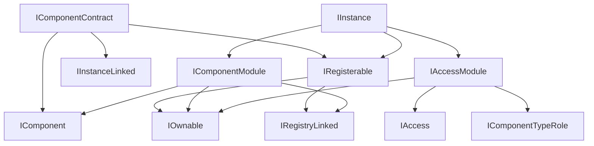
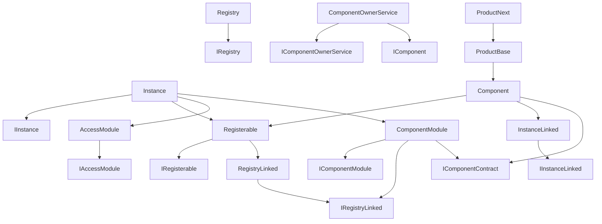

 ## Interfaces

```mermaid
graph TD;
    IRegisterable-->IOwnable;
    IRegisterable-->IRegistryLinked;

    IComponentContract --> IComponent;    IComponentContract --> IRegisterable;
    IComponentContract --> IInstanceLinked;

    IComponentModule --> IComponent;
    IComponentModule --> IOwnable;
    IComponentModule --> IRegistryLinked;

    IAccessModule --> IAccess
    IAccessModule --> IOwnable;
    IAccessModule --> IComponentTypeRole

    IInstance --> IRegisterable;
    IInstance --> IAccessModule;
    IInstance --> IComponentModule;

```

## Contracts

```mermaid
graph TD;

    RegistryLinked --> IRegistryLinked;

    Registerable --> IRegisterable;
    Registerable --> RegistryLinked;

    Registry --> IRegistry;

    Instance --> IInstance;
    Instance --> Registerable;
    Instance --> AccessModule;
    Instance --> ComponentModule;

    AccessModule --> IAccessModule;

    ComponentModule --> IComponentModule;
    ComponentModule --> IRegistryLinked;
    ComponentModule --> IComponentContract;

    ComponentOwnerService --> IComponentOwnerService;
    ComponentOwnerService --> IComponent;

    InstanceLinked --> IInstanceLinked;

    Component --> Registerable;
    Component --> InstanceLinked;
    Component --> IComponentContract;

    ProductNext --> ProductBase --> Component;
```

## Combined
